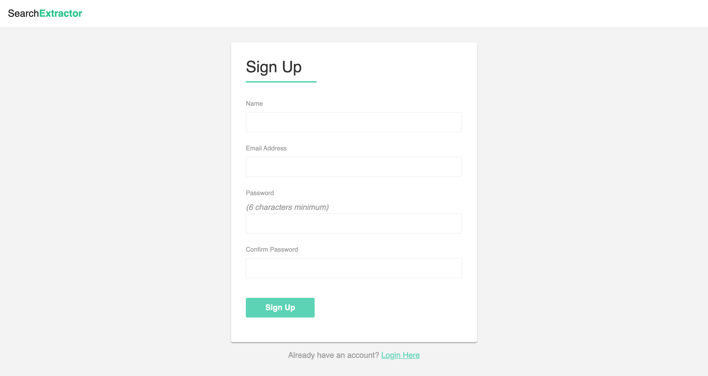
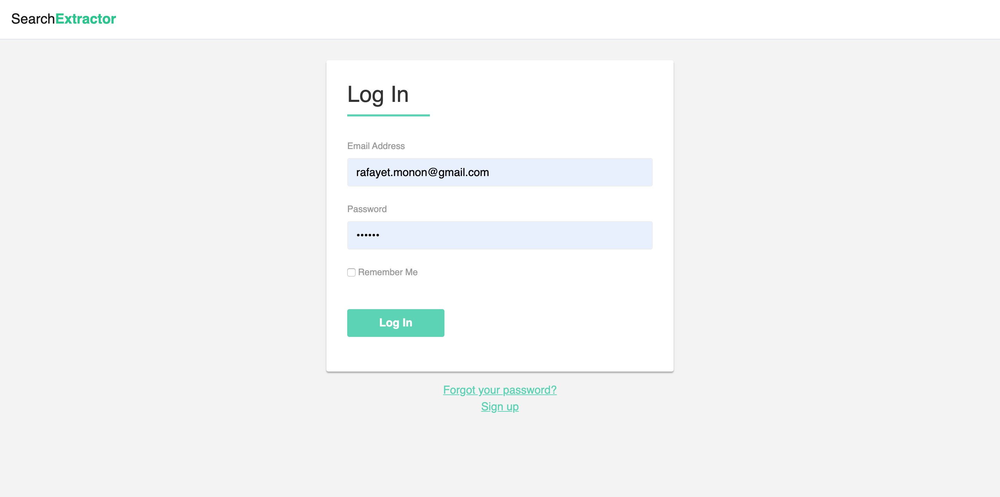
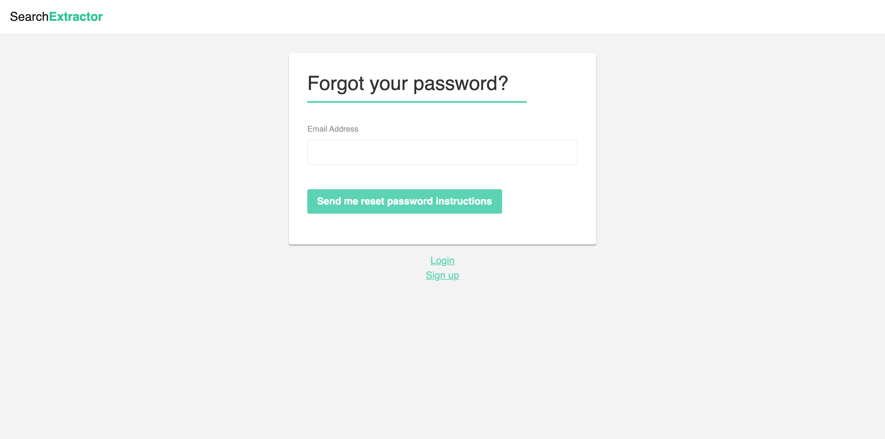
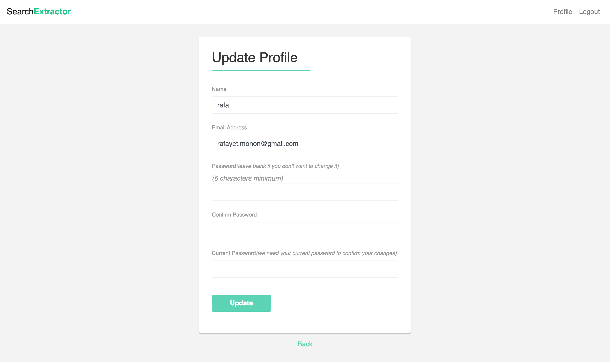
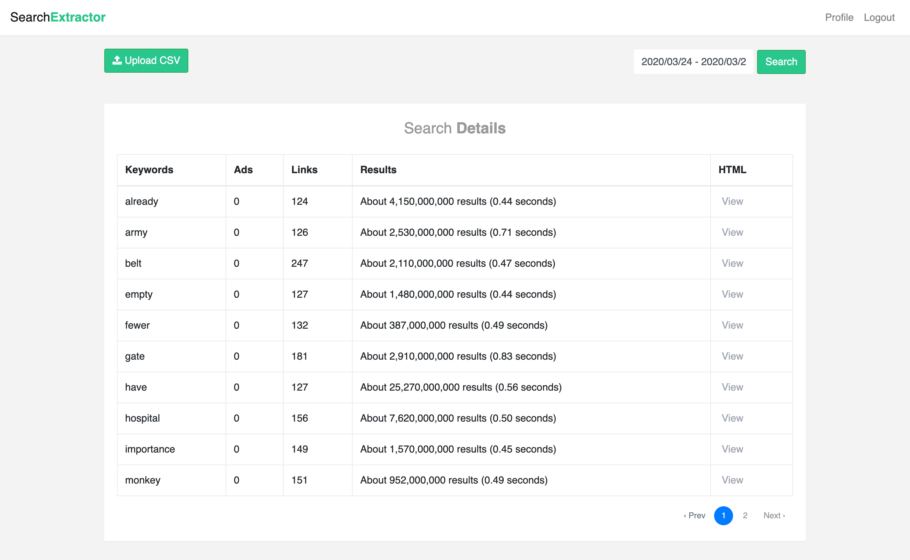
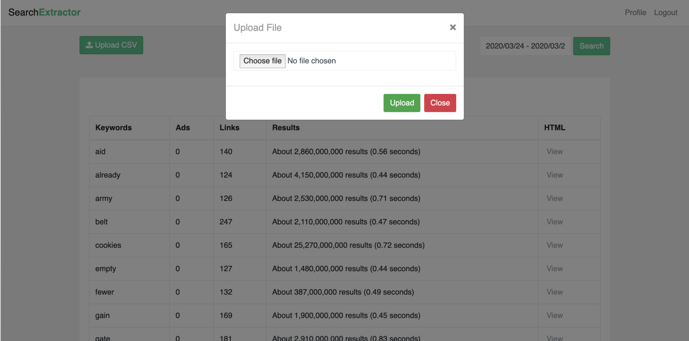
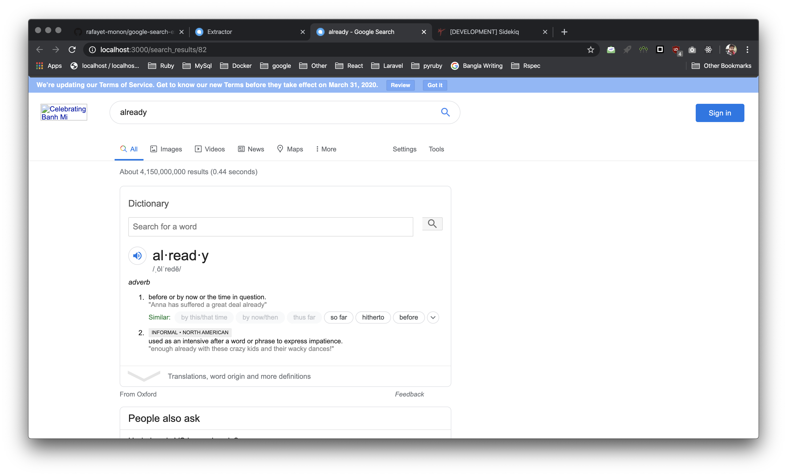

# Google Search Extractor

## Install

### Clone the repository

```shell
git clone git@github.com:rafayet-monon/google-search-extractor.git
cd google-search-extractor
```

### Check your Ruby version

```shell
ruby -v
```

The ouput should start with something like `ruby 2.6.4`

If not, install the right ruby version using [rbenv](https://github.com/rbenv/rbenv) (or rvm, whatever you prefer):

```shell
rbenv install 2.6.4
```

### Rails 6.0.2.1

### Install dependencies

Using [Bundler](https://github.com/bundler/bundler) and [Yarn](https://github.com/yarnpkg/yarn):

```shell
bundle && yarn
`````

### Set Credentials

Using rails credentials.yml.enc and master.key[(blog for details)](https://blog.eq8.eu/til/rails-52-credentials-tricks.html).
Use `EDITOR='nano' rails credentials:edit` to create new credentials.
Sample credentials can be found in `config/sample_credentials.yml`. Edit database and email credentials and paste it to
`credentials.yml.enc`.

### Mailer Setup

The mail is currently set up using google SMTP server. To configure your mail you have to add google `user_name` and
 `password`. To do that open the `credentials.ym.enc` and edit the below portion -
 
```shell
email:
  user_name: 'your_google_email'
  password: 'your_google_password'
```


### Initialize the database

```shell
rails db:create db:migrate db:seed
```

## Dependencies
This application uses the following dependencies that is need to be installed - 
1. Redis to manage Sidekiq.
2. Chromedriver for selenium to search in google.

## Testing
To run the tests simply execute the  below command within the application
```shell
rspec
```
## Serve
First run the redis server
```shell
redis-server
```
Then within the application execute below command to start the
application.
```shell
foreman start -f Procfile.dev 
```
## [See it live](https://search-extractor.herokuapp.com/)
The application is deployed in heroku. As `redis` is a service that 
requires credit cards info to work in `heroku` and I don't have one so file uploading and searching using `Sidekiq` is not
available there. The search is done in runtime after uploading the file. 
```shell
Requesting not to upload CSV file with large keyword set in heroku.
```
Demo User Credentials
```shell
email: john_doe@gmail.com
password: 123123
```
## [Sample CSV File](https://drive.google.com/open?id=19yR83H3uvOBZE6tO4400LSetQGilIKsF)
## Screenshots
Signup Page

Login Page

Forgot Password Page

Update Profile Page

Report Home Page

Upload File Page

Google HTML Page


